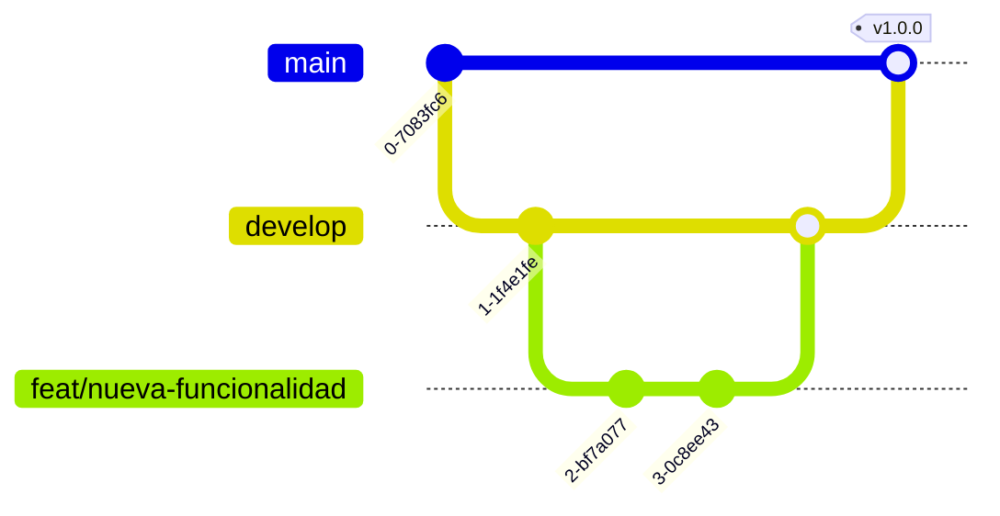

# Guía de Contribución

¡Gracias por tu interés en contribuir a **Programación Agnóstica**! Esta guía describe el flujo de trabajo, los estándares de código y el proceso de Pull Requests.

## Tabla de Contenidos

- [Configuración del Entorno](#configuración-del-entorno)
- [Flujo de Trabajo](#flujo-de-trabajo)
- [Estándares de Código](#estándares-de-código)
- [Commits y Mensajes](#commits-y-mensajes)
- [Pull Requests](#pull-requests)
- [Revisión de Código](#revisión-de-código)
- [Testing](#testing)

## Configuración del Entorno

Sigue las instrucciones de instalación del [README](README.md#instalación). Asegúrate de que los tests pasen localmente antes de empezar a trabajar.

## Flujo de Trabajo

Usamos un flujo **Git Flow** simplificado.

### Estrategia de Branching

| Rama       | Propósito                                        | Origen    | Destino            |
| ---------- | ------------------------------------------------ | --------- | ------------------ |
| `main`     | Código en producción. Siempre estable.           | —         | —                  |
| `develop`  | Integración de funcionalidades. Pre-release.     | `main`    | `main`             |
| `feat/*`   | Nueva funcionalidad.                             | `develop` | `develop`          |
| `fix/*`    | Corrección de bug no urgente.                    | `develop` | `develop`          |
| `hotfix/*` | Corrección urgente en producción.                | `main`    | `main` y `develop` |
| `docs/*`   | Cambios solo de documentación.                   | `develop` | `develop`          |
| `chore/*`  | Tareas de mantenimiento, tooling, configuración. | `develop` | `develop`          |



### Flujo de una funcionalidad

```bash
# 1. Parte de develop actualizado
git checkout develop
git pull origin develop

# 2. Crea tu rama
git checkout -b feat/nombre-descriptivo

# 3. Trabaja y commitea (ver formato abajo)
git add .
git commit -m "feat: agrega X"

# 4. Sube tu rama y abre un PR hacia develop
git push origin feat/nombre-descriptivo
```

### Flujo de hotfix

Los hotfix parten de `main`, se mergean a `main` y luego se sincronizan a `develop`.

```bash
git checkout main
git pull origin main
git checkout -b hotfix/descripcion-del-fix
# ... fix + commit ...
git push origin hotfix/descripcion-del-fix
```

### Nombrado de ramas

- En minúsculas, con prefijo de tipo y descripción en `kebab-case`: `feat/login-google`, `fix/timeout-pagos`, `docs/actualizar-readme`.

### Políticas de ramas

- `main` y `develop` están protegidas: no se permite push directo, solo vía PR aprobado.
- Mantén tu rama actualizada con `develop` (rebase o merge) antes de abrir el PR.

## Estándares de Código

### Formato

- Indentación y estilo definidos por [`.editorconfig`](.editorconfig) y el linter del proyecto.
- Líneas de máximo 100 caracteres.
- Codificación UTF-8, finales de línea LF.

### Nombrado

- Sigue las convenciones idiomáticas de cada lenguaje (`camelCase`/`snake_case`/`PascalCase` según corresponda).
- Nombres descriptivos; evita abreviaturas crípticas.

### Comentarios

- Comenta el _por qué_, no el _qué_. El código debe explicarse solo.
- Documenta las decisiones no obvias y enlaza al ADR correspondiente cuando aplique.

## Commits y Mensajes

Usamos [Conventional Commits](https://www.conventionalcommits.org/es/v1.0.0/):

```
<tipo>(<ámbito opcional>): <descripción breve en imperativo>

<cuerpo opcional>

<footer opcional: BREAKING CHANGE, Closes #123>
```

Tipos comunes: `feat`, `fix`, `docs`, `style`, `refactor`, `perf`, `test`, `build`, `ci`, `chore`.

Ejemplos:

```
feat(auth): agrega login con Google
fix(api): corrige timeout en el endpoint de pagos
docs: actualiza la guía de instalación
```

## Pull Requests

- Usa la [plantilla de PR](.github/PULL_REQUEST_TEMPLATE.md) (se carga automáticamente).
- Un PR por cambio lógico; mantenlos pequeños y enfocados.
- Vincula los issues relacionados (`Closes #123`).
- Asegúrate de que CI pase (tests, linting, build).

## Revisión de Código

**Como autor:**

- Haz una auto-revisión antes de pedir review.
- Responde a los comentarios y marca las conversaciones resueltas.

**Como revisor:**

- Sé respetuoso y específico; sugiere, no impongas.
- Verifica correctitud, legibilidad, tests y posibles regresiones.

## Verificación de ejemplos

- Ejecuta tu ejemplo con el intérprete/compilador de su lenguaje antes de abrir el PR.
- Verifica que corre sin errores y produce la salida esperada.
- Sigue las [convenciones de verificación](docs/conventions/testing.md) y el
  [formato por lenguaje](docs/conventions/quality-tooling.md).
